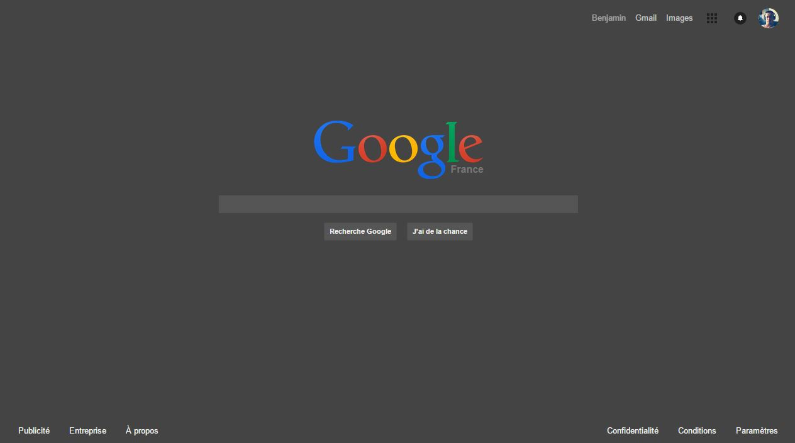

# darkGoogle
Chrome extension to change google design

## Why
As a web developper I use sublime text to edit my code with its dark theme. The problem is that I realy often need to look for help on google and going from a dark to a white page can hurt my eyes. I decided to change that and make google more comfortable to use.

## how to test

* clone the repository
* open chrome at `chrome://extensions/`
* in developper mode, open the none packed extension
* go to the google website of make a google search
